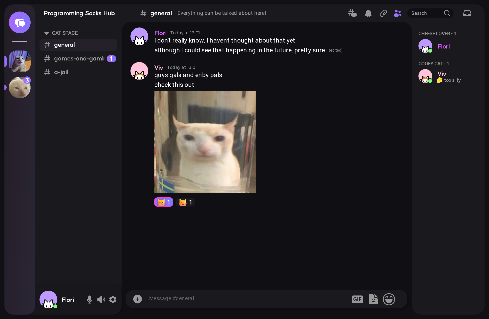

<!-- Improved compatibility of back to top link: See: https://github.com/othneildrew/Best-README-Template/pull/73 -->
<a name="readme-top"></a>

<div align="center">

[![Build][build-shield]][build-url]
[![Contributors][contributors-shield]][contributors-url]
[![Forks][forks-shield]][forks-url]
[![Stargazers][stars-shield]][stars-url]
[![Issues][issues-shield]][issues-url]
[![GPL3 License][license-shield]][license-url]

</div>

<!-- PROJECT LOGO -->
<br />
<div align="center">
  <a href="https://github.com/polyphony-chat/client">
    
  </a>

<h3 align="center">Polyphony</h3>

  <p align="center">
    A multi-instance, Discord/Spacebar API-compatible chat client, written in Rust and Svelte (TypeScript) using Tauri.
    <br />
    <a href="https://github.com/polyphony-chat/client"><strong>Explore the docs »</strong></a>
    <br />
    <br />
    <a href="https://github.com/polyphony-chat/client/issues">Report Bug</a>
    ·
    <a href="https://github.com/polyphony-chat/client/issues">Request Feature</a>
  </p>
</div>

<!-- TABLE OF CONTENTS -->
<details>
  <summary>Table of Contents</summary>
  <ol>
    <li>
      <a href="#about-the-project">About The Project</a>
      <ul>
        <li><a href="#built-with">Built With</a></li>
      </ul>
    </li>
    <li>
      <a href="#getting-started">Getting Started</a>
      <ul>
        <li><a href="#prerequisites">Prerequisites</a></li>
      </ul>
    </li>
    <li><a href="#roadmap">Roadmap</a></li>
    <li><a href="#contributing">Contributing</a></li>
    <li><a href="#license">License</a></li>
    <li><a href="#contact">Contact</a></li>
    <li><a href="#acknowledgments">Acknowledgments</a></li>
  </ol>
</details>

<!-- ABOUT THE PROJECT -->
## About The Project


<cite>*A mockup of the Polyphony client.*</cite>

Polyphony will be a multi-instance, Discord/Spacebar API-compatible chat client, written in Rust and Svelte (TypeScript) using Tauri. The three goals of this project are ease-of-use, user experience and performance.

Ideally, you will be able to connect to multiple Spacebar instances at the same time and use the client just like you would expect a regular Discord client to work.

### Spacebar? What's that?

[Go read about the Spacebar project here!](https://github.com/spacebarchat) Spacebar describes itself as "*a free open source selfhostable discord compatible chat, voice and video platform*".

<p align="right">(<a href="#readme-top">back to top</a>)</p>

### Built With

[![Svelte][Svelte.dev]][Svelte-url]
[![Rust]][Rust-url]
[![Typescript]][Typescript-url]

<p align="right">(<a href="#readme-top">back to top</a>)</p>

<!-- GETTING STARTED -->

## Getting Started

To set up a local development environment, follow these simple steps. This guide assumes you are using Linux.

### Prerequisites

Install the rust toolchain and cargo.

   ```sh
   curl --proto '=https' --tlsv1.2 -sSf https://sh.rustup.rs | sh
   ```

Install Node.js v19 and yarn

Arch Linux:

   ```sh
   sudo pacman -S nodejs yarn
   ```

Debian/Ubuntu:

   ```sh
   curl -fsSL https://deb.nodesource.com/setup_19.x | sudo -E bash -
   sudo apt-get install -y nodejs
   sudo npm install -g yarn
   ```

Clone this project and install dependencies

  ```sh
  git clone https://github.com/polyphony-chat/client.git
  cd client
  yarn install
  ```

You should now be able to run the client with `yarn tauri dev` from the project root.
You can independently build and run the Rust backend with `cargo run` from the `src-tauri` directory.

<p align="right">(<a href="#readme-top">back to top</a>)</p>

## Roadmap

See the [open issues](https://github.com/polyphony-chat/client/issues) for a full list of proposed features (and known issues).

<p align="right">(<a href="#readme-top">back to top</a>)</p>

<!-- CONTRIBUTING -->
## Contributing

Read: [Polyphony Design and collaboration guidelines](https://github.com/polyphony-chat/client/wiki/Design-Guidelines-for-collaborating-on-Polyphony)

Contributions are what make the open source community such an amazing place to learn, inspire, and create. Any contributions you make are **greatly appreciated**.

If you have a suggestion that would make this better, please fork the repo and create a pull request. You can also simply open an issue with the tag "enhancement".
Don't forget to give the project a star! Thanks again!

If you want to contribute code, please follow these steps:

1. Find a [feature or issue you want to work on](https://github.com/polyphony-chat/client/issues). If you want to work on something that is not listed, open an issue and we will discuss it.
2. Let it be known in the issue that you are working on it. This is to avoid duplicate work, especially since currently this project is still in its early stages and there are not many contributors.
3. Fork the Project
4. Create your Feature Branch (`git checkout -b feature/AmazingFeature`)
5. Commit your changes (`git commit -m 'Add some AmazingFeature'`)
6. Push to the Branch (`git push origin feature/AmazingFeature`)
7. Open a Pull Request

<p align="right">(<a href="#readme-top">back to top</a>)</p>

<!-- LICENSE -->
## License

Distributed under the GPLv3 License. See `LICENSE.txt` for more information.

<p align="right">(<a href="#readme-top">back to top</a>)</p>

<!-- CONTACT -->
## Contact

florian@pro-weber.com

Project Link: [https://github.com/polyphony-chat/client](https://github.com/polyphony-chat/client)

<p align="right">(<a href="#readme-top">back to top</a>)</p>

<!-- ACKNOWLEDGMENTS -->
<!-- TODO>
## Acknowledgments

* []()
* []()
* []()

<p align="right">(<a href="#readme-top">back to top</a>)</p>

<!-- MARKDOWN LINKS & IMAGES -->
<!-- https://www.markdownguide.org/basic-syntax/#reference-style-links -->
[build-shield]: https://img.shields.io/github/actions/workflow/status/polyphony-chat/client/rust.yml?style=plastic
[build-url]: https://github.com/polyphony-chat/client/blob/main/.github/workflows/rust.yml
[contributors-shield]: https://img.shields.io/github/contributors/polyphony-chat/client.svg?style=plastic
[contributors-url]: https://github.com/polyphony-chat/client/graphs/contributors
[forks-shield]: https://img.shields.io/github/forks/polyphony-chat/client.svg?style=plastic
[forks-url]: https://github.com/polyphony-chat/client/network/members
[stars-shield]: https://img.shields.io/github/stars/polyphony-chat/client.svg?style=plastic
[stars-url]: https://github.com/polyphony-chat/client/stargazers
[issues-shield]: https://img.shields.io/github/issues/polyphony-chat/client.svg?style=plastic
[issues-url]: https://github.com/polyphony-chat/client/issues
[license-shield]: https://img.shields.io/github/license/polyphony-chat/client.svg?style=plastic
[license-url]: https://github.com/polyphony-chat/client/blob/master/LICENSE
[Svelte.dev]: https://img.shields.io/badge/Svelte-4A4A55?style=plastic&logo=svelte&logoColor=FF3E00
[Svelte-url]: https://svelte.dev/
[Rust]: https://img.shields.io/badge/Rust-orange?style=plastic&logo=rust
[Rust-url]: https://www.rust-lang.org/
[Typescript]: https://img.shields.io/badge/TypeScript-blue?style=plastic&logo=typescript&logoColor=FFFFFF
[Typescript-url]: https://www.typescriptlang.org/
